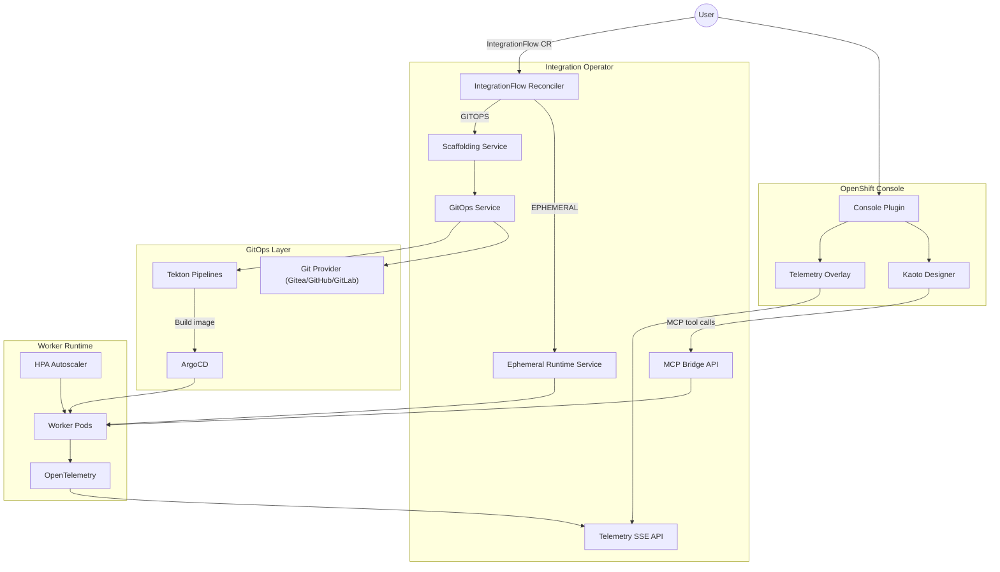

<p align="center">
  
</p>

<h1 align="center">OpenShift Integration Operator</h1>

<p align="center">
  <strong>Real-Time Integration & Orchestration Platform for OpenShift</strong>
</p>

<p align="center">
  Open-source alternative to n8n, powered by Apache Camel + CNCF SonataFlow, with visual Kaoto designer, MCP/AI integration, and native Kubernetes orchestration.
</p>

<p align="center">
  <a href="https://www.apache.org/licenses/LICENSE-2.0"></a>
  <a href="https://github.com/maximilianoPizarro/openshift-integration-operator/actions"></a>
  <a href="https://quay.io/repository/maximilianopizarro/openshift-integration-operator"></a>
</p>

<p align="center">
  <a href="https://maximilianopizarro.github.io/openshift-integration-operator/">Documentation</a> ·
  <a href="https://artifacthub.io/packages/search?repo=openshift-integration-operator">Artifact Hub</a> ·
  <a href="docs/architecture.html">Architecture</a> ·
  <a href="docs/quickstart.html">Quick Start</a> ·
  <a href="docs/operations.html">Operations</a> ·
  <a href="docs/examples-catalog.html">Examples (255)</a>
</p>

---

## Features

- **Five Integration Types** — Run Camel Routes, Kamelets, Pipes, Tests, or SonataFlow workflows from a single `IntegrationFlow` CR
- **Quick Try (Ephemeral) Mode** — Deploy and test flows directly in the cluster without Git or ArgoCD; configurable TTL, extend, and promote to GitOps
- **Multi-Provider Git** — Connect to Gitea, GitHub, or GitLab for scaffolded worker source with auto-detection
- **Visual Designer** — Embedded Kaoto canvas in the OpenShift Console for drag-and-drop flow design
- **GitOps Native** — Tekton builds container images; ArgoCD syncs worker deployments from Git
- **MCP/AI Ready** — Model Context Protocol bridge for discovering and invoking AI tools in flows
- **Observable** — OpenTelemetry instrumentation with real-time SSE telemetry for canvas node coloring
- **Auto-scaling Workers** — HPA v2-driven worker pods scale on CPU and memory utilization
- **Multi-cluster** — Target multiple clusters from a single IntegrationFlow spec via ArgoCD ApplicationSets
- **SonataFlow Integration** — Auto-deploys SonataFlow CRs to the OpenShift Serverless Logic operator with Management Console links
- **Lifecycle Management** — Pause/Resume/Stop, scheduled execution, declarative retry + circuit breaker
- **Platform Dashboard** — Real-time health monitoring of Operator, Kaoto, Gitea, ArgoCD, Tekton, OTel
- **Apache 2.0 License** — Free to use, modify, and distribute

## Screenshots

| Integration Flows | Visual Diagram | Kaoto Designer |
|---|---|---|
|  |  |  |

| YAML Editor | Spec & Status | Platform Status |
|---|---|---|
|  |  |  |

## Architecture Overview



See the full [Architecture Documentation](docs/architecture.html) for CRD details, reconciliation steps, and telemetry pipeline.

## Quick Start

### Prerequisites

- OpenShift 4.14+
- Helm 3
- `oc` CLI
- For **GitOps mode**: Git server (Gitea, GitHub, or GitLab), ArgoCD, and Tekton Pipelines
- For **Quick Try (ephemeral) mode**: only the operator and `kaotoDesign` in the CR — no Git required

### Install with Helm

```bash
helm repo add integration-platform \
  https://maximilianopizarro.github.io/openshift-integration-operator/

helm repo update

helm install integration-operator \
  integration-platform/openshift-integration-operator \
  --namespace openshift-integration \
  --create-namespace
```

### Example: Camel Route — REST to Kafka

```bash
oc apply -f - <<'EOF'
apiVersion: platform.io/v1alpha1
kind: IntegrationFlow
metadata:
  name: rest-to-kafka
  namespace: openshift-integration
spec:
  integrationType: CAMEL_ROUTE
  engine: CAMEL
  gitRepository: https://gitea.example.com/user1/rest-to-kafka
  branch: main
  targeting:
    strategy: explicit
    clusters:
      - local
  kaotoDesign: |
    - route:
        id: rest-to-kafka
        from:
          uri: "platform-http:/api/ingest"
          steps:
            - log:
                message: "Received: ${body}"
            - to:
                uri: "kafka:integration-events?brokers=my-cluster-kafka-bootstrap:9092"
EOF
```

### Example: Camel Route — Content-Based Routing

```bash
oc apply -f - <<'EOF'
apiVersion: platform.io/v1alpha1
kind: IntegrationFlow
metadata:
  name: order-routing-cbr
  namespace: openshift-integration
spec:
  integrationType: CAMEL_ROUTE
  engine: CAMEL
  gitRepository: https://gitea.example.com/user1/order-routing-cbr
  branch: main
  targeting:
    strategy: explicit
    clusters:
      - local
  kaotoDesign: |
    - route:
        id: order-routing-cbr
        from:
          uri: "platform-http:/api/orders"
          steps:
            - unmarshal:
                json: {}
            - choice:
                when:
                  - simple: "${body[priority]} == 'high'"
                    steps:
                      - log:
                          message: "CRITICAL: fast-track order"
                otherwise:
                  steps:
                    - log:
                        message: "Standard order processing"
EOF
```

### Example: SonataFlow Workflow

```bash
oc apply -f - <<'EOF'
apiVersion: platform.io/v1alpha1
kind: IntegrationFlow
metadata:
  name: file-processor-workflow
  namespace: openshift-integration
spec:
  integrationType: SONATAFLOW
  engine: SONATAFLOW
  gitRepository: https://gitea.example.com/user1/file-processor-workflow
  branch: main
  targeting:
    strategy: explicit
    clusters:
      - local
  kaotoDesign: |
    id: file-processor-workflow
    version: "1.0"
    specVersion: "0.8"
    name: File Processor Workflow
    start: InitState
    states:
      - name: InitState
        type: operation
        actions:
          - functionRef:
              refName: processAction
        transition: CheckResult
      - name: CheckResult
        type: switch
        dataConditions:
          - condition: "${ .result == true }"
            transition: SuccessState
        defaultCondition:
          transition: ErrorState
      - name: SuccessState
        type: operation
        actions:
          - functionRef:
              refName: notifySuccess
        end: true
      - name: ErrorState
        type: operation
        actions:
          - functionRef:
              refName: handleError
        end: true
    functions:
      - name: processAction
        type: expression
        operation: ".result = true"
      - name: notifySuccess
        type: expression
        operation: ".message = \"Success\""
      - name: handleError
        type: expression
        operation: ".message = \"Error handled\""
EOF
```

### Example: Ephemeral Quick Try (no Git)

```bash
oc apply -f k8s/examples/09-ephemeral-demo.yaml

# Watch reconciliation
oc get integrationflow ephemeral-camel-demo -w

# Extend TTL or promote via console UI, or REST API:
# POST /api/flows/ephemeral-camel-demo/ephemeral/extend?seconds=3600
# POST /api/flows/ephemeral-camel-demo/promote-to-gitops
```

The platform ships **9 pre-built examples** covering Camel Routes, Kamelets, Pipes, SonataFlow workflows, and ephemeral Quick Try, plus a **[catalog of 255 examples](docs/examples-catalog.html)** spanning 15 categories and 310 Apache Camel Quarkus components.

See the [Quick Start Guide](docs/quickstart.html) for all 9 examples, the [Examples Catalog](docs/examples-catalog.html) for 255 ready-to-use flows, and the [Operations Guide](docs/operations.html) for validation and troubleshooting.

## Project Structure

```
openshift-integration-operator/
├── src/main/java/io/platform/
│   ├── api/v1alpha1/          # IntegrationFlow CRD types + DeploymentMode enum
│   ├── operator/              # Reconciler controller
│   ├── ephemeral/             # Ephemeral runtime deployers (Quick Try mode)
│   ├── service/               # Scaffolding & GitOps services
│   │   └── git/               # GitProvider interface + Gitea/GitHub/GitLab impls
│   ├── telemetry/             # SSE telemetry API
│   └── mcp/                   # MCP bridge API
├── console-plugin/            # OpenShift Console dynamic plugin
│   ├── src/components/        # React UI (Kaoto, telemetry overlay)
│   └── console-extensions.json
├── helm/openshift-integration-operator/
│   ├── templates/             # Operator, HPA, ConsolePlugin, Kaoto manifests
│   ├── values.yaml
│   └── Chart.yaml
├── docs/                        # GitHub Pages site
│   ├── index.html
│   ├── architecture.html
│   ├── quickstart.html
│   ├── operations.html
│   └── artifacthub-repo.yml
├── scripts/
│   ├── deploy-cluster.sh      # Binary-build operator + plugin, Helm upgrade
│   └── cleanup-failed-builds.sh
├── .github/workflows/
│   └── build-push-quay.yml    # CI: build, test, push to Quay.io
└── pom.xml                      # Quarkus + Operator SDK
```

## Development Setup

### Requirements

- JDK 17
- Maven 3.9+
- Node.js 18+ (for console plugin)
- Docker (for container builds)

### Run the Operator Locally

```bash
# Start in Quarkus dev mode (hot reload)
mvn quarkus:dev
```

The operator exposes REST endpoints at `http://localhost:8080`:

| Endpoint | Description |
|----------|-------------|
| `GET /api/telemetry/stream/{flowId}` | SSE stream of node telemetry |
| `GET /api/telemetry/snapshot/{flowId}` | Point-in-time node status |
| `GET /api/mcp/tools?serverUrl=...` | List MCP tools |
| `POST /api/mcp/tools/{name}/call` | Invoke an MCP tool |
| `POST /api/flows/{name}/ephemeral/extend?seconds=` | Extend ephemeral TTL |
| `POST /api/flows/{name}/promote-to-gitops` | Promote ephemeral flow to GitOps |
| `GET /api/flows/{name}/logs` | Fetch worker pod logs (console Logs tab) |

### Build Console Plugin

```bash
cd console-plugin
npm install
npm run build
```

Or build the container image (nginx on port 9443):

```bash
docker build -f console-plugin/Dockerfile \
  -t quay.io/maximilianopizarro/integration-console-plugin:dev console-plugin
```

The plugin proxies API calls through `/api/proxy/plugin/integration-console-plugin/backend` (telemetry, lifecycle, logs).

### Build Container Image

```bash
mvn package -DskipTests
docker build -f src/main/docker/Dockerfile.jvm \
  -t quay.io/maximilianopizarro/openshift-integration-operator:dev .
```

## Deploy to a Cluster

For development clusters with OpenShift binary builds:

```bash
mvn -B package -DskipTests
./scripts/deploy-cluster.sh
```

This builds operator + console plugin ImageStreams, runs Helm upgrade, and prints ephemeral smoke-test commands.

For Quay.io images, use Helm with `operator.image.tag` and `consolePlugin.image.tag` as shown in the [Helm README](helm/openshift-integration-operator/README.md).

## CI/CD Overview

| Workflow | Trigger | Actions |
|----------|---------|---------|
| **Build and push to Quay.io** | Push to `main`, tags `v*`, manual dispatch | Maven test, push operator + console plugin images to Quay.io, package Helm chart to `docs/` |

Images are published to:

```
quay.io/maximilianopizarro/openshift-integration-operator:latest
quay.io/maximilianopizarro/integration-console-plugin:latest
```

Helm charts are served from GitHub Pages:

```
https://maximilianopizarro.github.io/openshift-integration-operator/
```

## Contributing

Contributions are welcome! To get started:

1. Fork the repository
2. Create a feature branch (`git checkout -b feature/my-change`)
3. Make your changes and add tests where applicable
4. Run `mvn test` to verify
5. Submit a pull request with a clear description of the change

Please follow existing code conventions and keep changes focused.

## OperatorHub Publication

The operator automatically generates an OLM bundle with each Maven build via `quarkus-operator-sdk-bundle-generator`.

### Bundle Location
After building (`mvn clean package`), the bundle is generated at:
- `target/bundle/openshift-integration-operator/manifests/` — CSV and CRD manifests
- `target/bundle/openshift-integration-operator/metadata/` — annotations.yaml

### Validating the Bundle

```bash
# Install operator-sdk if not present
# Validate bundle structure
operator-sdk bundle validate target/bundle/openshift-integration-operator

# Validate against OperatorHub requirements
operator-sdk bundle validate target/bundle/openshift-integration-operator \
  --select-optional name=operatorhub

# Build bundle image
docker build -f target/bundle/openshift-integration-operator/bundle.Dockerfile \
  -t quay.io/yourorg/openshift-integration-operator-bundle:v0.2.0 .
```

### Required CSV Annotations
The generated CSV must include these annotations for OperatorHub:
- `capabilities`: e.g., "Full Lifecycle"
- `categories`: e.g., "Integration & Delivery"
- `containerImage`: operator image reference
- `repository`: GitHub repository URL
- `description`: Short operator description
- `alm-examples`: JSON array of example CRs

### Publishing Steps
1. Fork [community-operators](https://github.com/k8s-operatorhub/community-operators)
2. Copy bundle to `operators/openshift-integration-operator/0.2.0/`
3. Submit PR — CI validates CSV, CRD ownership, RBAC, and metadata
4. After merge, operator appears on OperatorHub.io within 24h

## License

This project is licensed under the [Apache License 2.0](https://www.apache.org/licenses/LICENSE-2.0).

---

<p align="center">
  Built by <a href="https://github.com/maximilianoPizarro"><strong>maximilianoPizarro</strong></a>
  ·
  <a href="https://maximilianopizarro.github.io/openshift-integration-operator/">GitHub Pages</a>
</p>
