<p align="center">
  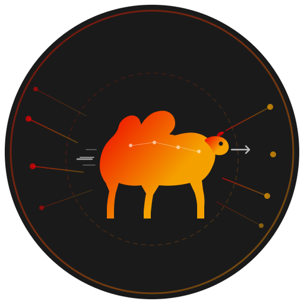
</p>

<h1 align="center">OpenShift Integration Operator</h1>

<p align="center">
  <strong>Real-Time Integration & Orchestration Platform for OpenShift</strong>
</p>

<p align="center">
  Open-source alternative to n8n, powered by Apache Camel + CNCF SonataFlow, with visual Kaoto designer, MCP/AI integration, and native Kubernetes orchestration.
</p>

<p align="center">
  <a href="https://www.apache.org/licenses/LICENSE-2.0"></a>
  <a href="https://github.com/maximilianoPizarro/openshift-integration-operator/actions"></a>
  <a href="https://quay.io/repository/maximilianopizarro/openshift-integration-operator"></a>
</p>

<p align="center">
  <a href="https://maximilianopizarro.github.io/openshift-integration-operator/">Documentation</a> ·
  <a href="https://artifacthub.io/packages/search?repo=openshift-integration-operator">Artifact Hub</a> ·
  <a href="https://maximilianopizarro.github.io/openshift-integration-operator/architecture.html">Architecture</a> ·
  <a href="https://maximilianopizarro.github.io/openshift-integration-operator/quickstart.html">Quick Start</a> ·
  <a href="https://maximilianopizarro.github.io/openshift-integration-operator/ready-flows.html">Ready Flows (200+)</a> ·
  <a href="https://maximilianopizarro.github.io/openshift-integration-operator/examples-catalog.html">Examples (255)</a>
</p>

---

## Features

- **Five Integration Types** — Run Camel Routes, Kamelets, Pipes, Tests, or SonataFlow workflows from a single `IntegrationFlow` CR
- **Quick Try (Ephemeral) Mode** — Deploy and test flows directly in the cluster without Git or ArgoCD; configurable TTL, extend, and promote to GitOps
- **Multi-Provider Git** — Connect to Gitea, GitHub, or GitLab for scaffolded worker source with auto-detection
- **Visual Designer** — Embedded Kaoto canvas in the OpenShift Console for drag-and-drop flow design
- **GitOps Native** — Scaffold to Gitea → Tekton builds Quarkus worker images → Argo CD syncs `base/` manifests
- **Template Catalog** — Browse 200+ ready flows from the console create form (`docs/flow-catalog.json`)
- **MCP/AI Ready** — Model Context Protocol bridge for discovering and invoking AI tools in flows
- **Observable** — OpenTelemetry instrumentation with real-time SSE telemetry for canvas node coloring
- **Auto-scaling Workers** — HPA v2-driven worker pods scale on CPU and memory utilization
- **Multi-cluster** — Target multiple clusters from a single IntegrationFlow spec via ArgoCD ApplicationSets
- **SonataFlow Integration** — Auto-deploys SonataFlow CRs to the OpenShift Serverless Logic operator with Management Console links
- **Lifecycle Management** — Pause/Resume/Stop, scheduled execution, declarative retry + circuit breaker
- **Platform Dashboard** — Real-time health monitoring of Operator, Kaoto, Gitea, ArgoCD, Tekton, OTel
- **Apache 2.0 License** — Free to use, modify, and distribute

## Screenshots

| Integration Flows | Visual Diagram | Kaoto Designer |
|---|---|---|
| 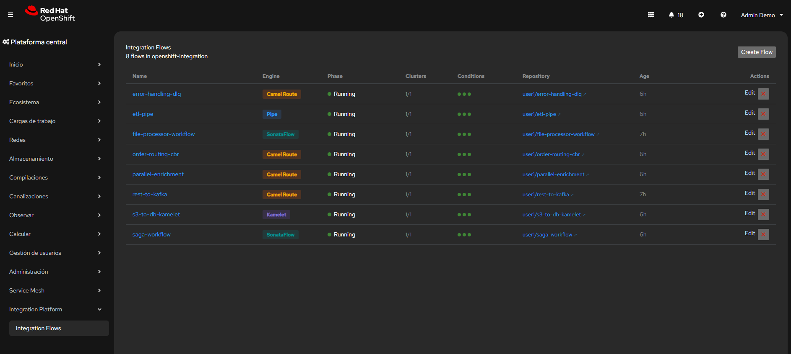 | 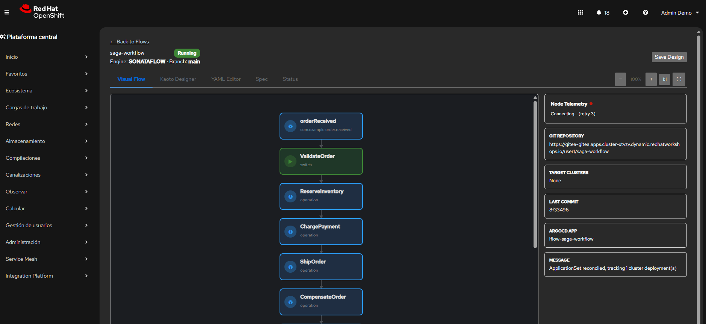 | 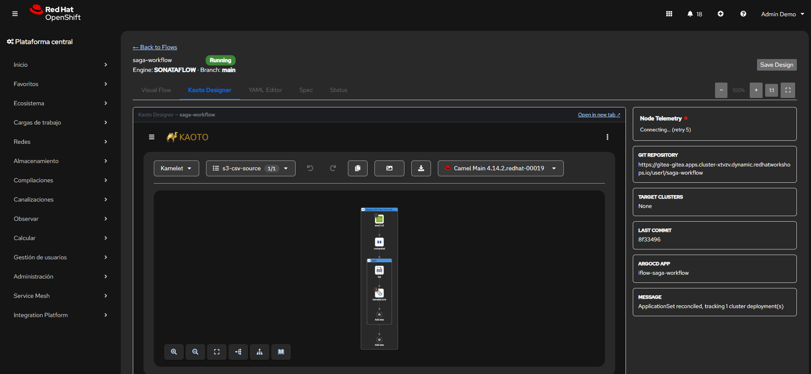 |

| YAML Editor | Spec & Status | Platform Status |
|---|---|---|
| 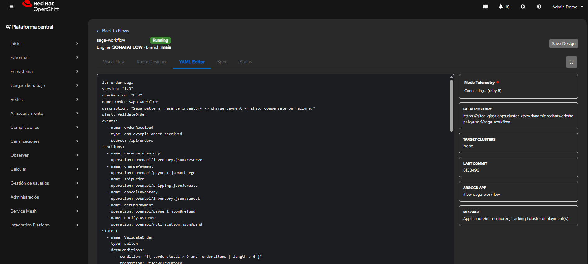 | 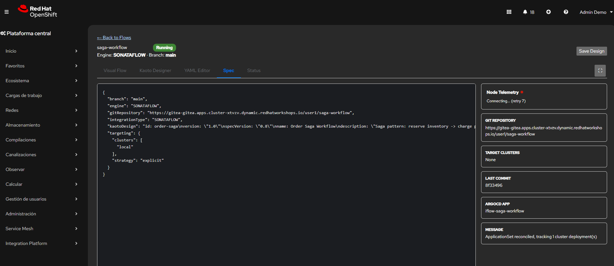 | 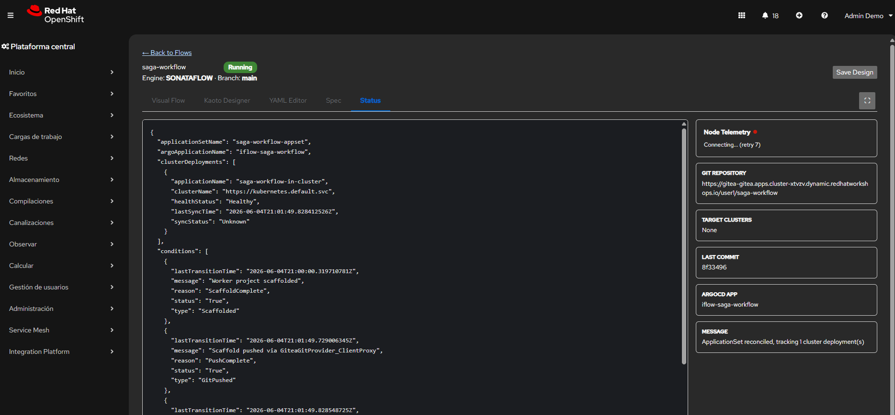 |

| Flow Overview | Flow Logs | Lifecycle Controls |
|---|---|---|
| 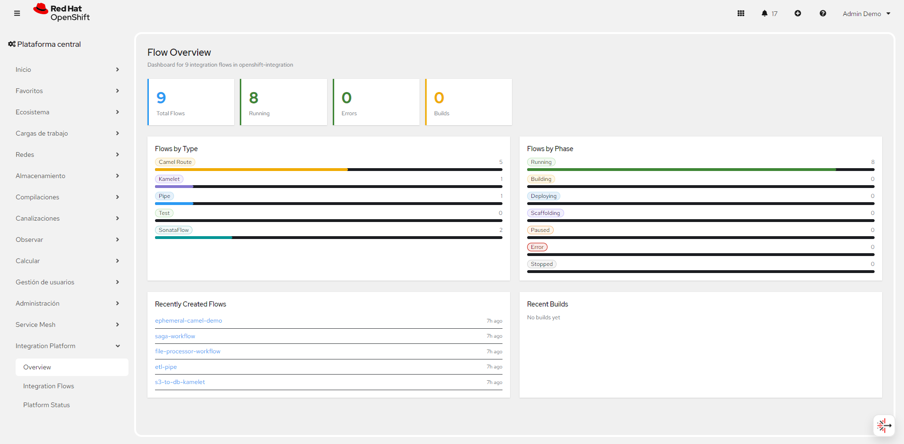 | 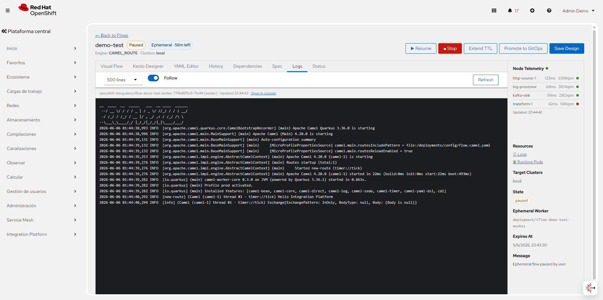 | 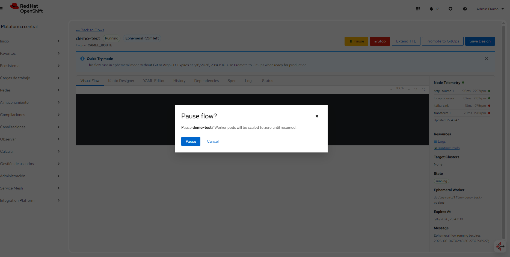 |

## Architecture Overview

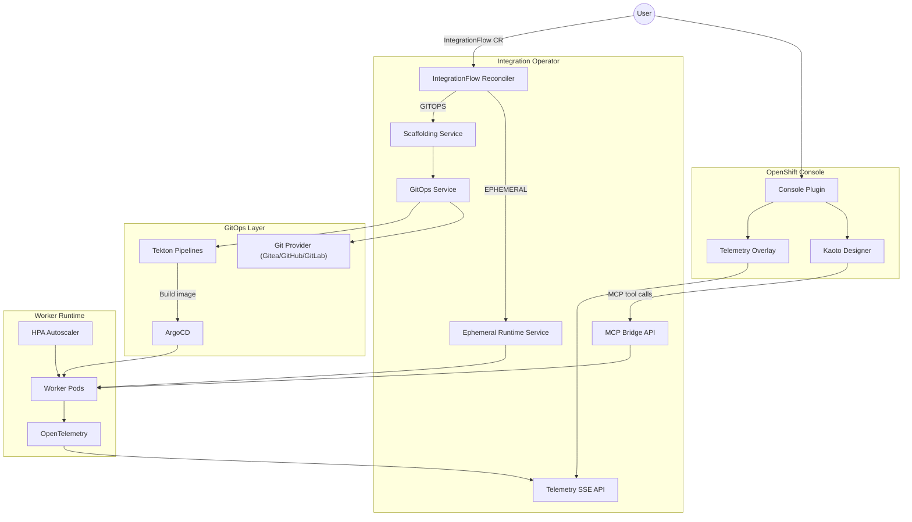

See the full [Architecture Documentation](docs/architecture.html) for CRD details, reconciliation steps, and telemetry pipeline.

## Quick Start

### Prerequisites

- OpenShift 4.14+
- Helm 3
- `oc` CLI
- For **GitOps mode**: Git server (Gitea, GitHub, or GitLab), ArgoCD, and Tekton Pipelines
- For **Quick Try (ephemeral) mode**: only the operator and `kaotoDesign` in the CR — no Git required

### Install with Helm

> **API note:** Use `spec.targeting.strategy` + `spec.targeting.clusters` (or `clusterSelector` for multicluster). The legacy field `spec.targetClusters` is deprecated — copying old examples will leave flows in `Error` phase.

```bash
helm repo add integration-platform \
  https://maximilianopizarro.github.io/openshift-integration-operator/

helm repo update

helm install integration-operator \
  integration-platform/openshift-integration-operator \
  --namespace openshift-integration \
  --create-namespace \
  --set gitea.password='your-gitea-password' \
  --set tekton.approvalEnabled=false
```

For development clusters, see [Deploy to a Cluster](#deploy-to-a-cluster) (binary build + Quay console plugin).

### GitOps examples (8 catalog flows)

Pre-built examples in `k8s/examples/` exercise the full pipeline (Gitea → Tekton → Argo CD):

| File | Flow | Type |
|------|------|------|
| `01-rest-to-kafka.yaml` | rest-to-kafka | Camel Route |
| `02-order-routing-cbr.yaml` | order-routing-cbr | Camel Route |
| `03-parallel-enrichment.yaml` | parallel-enrichment | Camel Route |
| `04-error-handling-dlq.yaml` | error-handling-dlq | Camel Route |
| `05-s3-to-db-kamelet.yaml` | s3-to-db-kamelet | Kamelet |
| `06-etl-pipe.yaml` | etl-pipe | Pipe |
| `07-file-processor-workflow.yaml` | file-processor-workflow | Camel Route |
| `08-saga-workflow.yaml` | saga-workflow | Camel Route |

Apply sequentially (~12s between flows to avoid Gitea contention):

```bash
for yaml in 01-rest-to-kafka 02-order-routing-cbr 03-parallel-enrichment \
  04-error-handling-dlq 05-s3-to-db-kamelet 06-etl-pipe \
  07-file-processor-workflow 08-saga-workflow; do
  oc apply -f "k8s/examples/${yaml}.yaml"
  sleep 12
done
```

**Camel K bootstrap** (required for Pipe/Kamelet examples):

```bash
oc apply -f k8s/bootstrap/camel-k-platform.yaml

TOKEN=$(oc whoami -t)
oc create secret docker-registry camel-k-registry-auth \
  -n openshift-integration \
  --docker-server=image-registry.openshift-image-registry.svc:5000 \
  --docker-username=$(oc whoami) \
  --docker-password="$TOKEN" \
  --dry-run=client -o yaml | oc apply -f -

oc patch integrationplatform camel-k -n openshift-integration --type=merge \
  -p '{"spec":{"build":{"registry":{"secret":"camel-k-registry-auth"}}}}'
```

Verify: `oc get integrationflow -n openshift-integration` → all eight in `Running` phase.

### Example: Camel Route — REST to Kafka

```bash
oc apply -f - <<'EOF'
apiVersion: platform.io/v1alpha1
kind: IntegrationFlow
metadata:
  name: rest-to-kafka
  namespace: openshift-integration
spec:
  deploymentMode: GITOPS
  integrationType: CAMEL_ROUTE
  engine: CAMEL
  gitRepository: https://gitea.example.com/user1/rest-to-kafka
  branch: main
  targeting:
    strategy: explicit
    clusters:
      - local
  kaotoDesign: |
    - route:
        id: rest-to-kafka
        from:
          uri: "platform-http:/api/ingest"
          steps:
            - log:
                message: "Received: ${body}"
            - to:
                uri: "kafka:integration-events?brokers=my-cluster-kafka-bootstrap:9092"
EOF
```

### Example: Camel Route — Content-Based Routing

```bash
oc apply -f - <<'EOF'
apiVersion: platform.io/v1alpha1
kind: IntegrationFlow
metadata:
  name: order-routing-cbr
  namespace: openshift-integration
spec:
  deploymentMode: GITOPS
  integrationType: CAMEL_ROUTE
  engine: CAMEL
  gitRepository: https://gitea.example.com/user1/order-routing-cbr
  branch: main
  targeting:
    strategy: explicit
    clusters:
      - local
  kaotoDesign: |
    - route:
        id: order-routing-cbr
        from:
          uri: "platform-http:/api/orders"
          steps:
            - unmarshal:
                json: {}
            - choice:
                when:
                  - simple: "${body[priority]} == 'high'"
                    steps:
                      - log:
                          message: "CRITICAL: fast-track order"
                otherwise:
                  steps:
                    - log:
                        message: "Standard order processing"
EOF
```

### Example: Camel Route — File Processor with CSV + CBR

```bash
oc apply -f - <<'EOF'
apiVersion: platform.io/v1alpha1
kind: IntegrationFlow
metadata:
  name: file-processor-workflow
  namespace: openshift-integration
spec:
  deploymentMode: GITOPS
  integrationType: CAMEL_ROUTE
  engine: CAMEL
  gitRepository: https://gitea.example.com/user1/file-processor-workflow
  branch: main
  targeting:
    strategy: explicit
    clusters:
      - local
  kaotoDesign: |
    - route:
        id: file-processor-workflow
        from:
          uri: "file:/data/inbox?noop=true&include=.*\\.csv"
          steps:
            - unmarshal:
                csv:
                  useMaps: true
            - split:
                simple: "${body}"
                steps:
                  - choice:
                      when:
                        - simple: "${body[status]} == 'ACTIVE'"
                          steps:
                            - log:
                                message: "Active record: ${body[id]} — ${body[name]}"
                            - to:
                                uri: "direct:process-active"
                        - simple: "${body[status]} == 'PENDING'"
                          steps:
                            - log:
                                message: "Pending record: ${body[id]} — queued for review"
                            - to:
                                uri: "direct:queue-review"
                      otherwise:
                        steps:
                          - log:
                              message: "Skipping inactive record: ${body[id]}"
                          - to:
                              uri: "file:/data/archive"
EOF
```

### Example: Ephemeral Quick Try (no Git)

```bash
oc apply -f k8s/examples/09-ephemeral-demo.yaml

# Watch reconciliation
oc get integrationflow ephemeral-camel-demo -w

# Extend TTL or promote via console UI, or REST API:
# POST /api/flows/ephemeral-camel-demo/ephemeral/extend?seconds=3600
# POST /api/flows/ephemeral-camel-demo/promote-to-gitops
```

The platform ships **29 pre-built examples** in `k8s/examples/` — eight GitOps catalog flows (`01`–`08`), one ephemeral demo (`09`), and twenty public-API Quick Try flows (`10`–`21`). Browse online:

- **[Ready Flows (200+)](https://maximilianopizarro.github.io/openshift-integration-operator/ready-flows.html)** — Complete IntegrationFlow CRs with full Camel route logic, organized by pattern (AI/LLM, Saga, Circuit Breaker, Decision, Event-Driven, API Gateway, ETL, IoT, Orchestration, Hybrid Cloud & Multi-Cloud SaaS for ROSA/ARO/GCP, Public APIs, Enterprise Automation)
- **[Examples Catalog (255)](https://maximilianopizarro.github.io/openshift-integration-operator/examples-catalog.html)** — Component-focused examples spanning 15 categories and 310 Apache Camel Quarkus components
- **[Quick Start Guide](https://maximilianopizarro.github.io/openshift-integration-operator/quickstart.html)** — Install + 10 examples including multi-cluster selector

### Ephemeral Quickstart (No Auth Required)

Try these immediately after login — they call public APIs and require zero configuration:

```bash
oc apply -f k8s/examples/10-ephemeral-jsonplaceholder.yaml   # Poll posts + split
oc apply -f k8s/examples/11-ephemeral-bitcoin-price.yaml     # Exchange rate monitor
oc apply -f k8s/examples/13-ephemeral-countries-cbr.yaml     # Content-based routing
oc apply -f k8s/examples/18-ephemeral-decision-circuit-breaker.yaml  # Circuit breaker + fallback
oc apply -f k8s/examples/19-ephemeral-saga-multi-api.yaml    # Saga orchestration
oc apply -f k8s/examples/20-ephemeral-api-composition.yaml   # Multi-API + segmentation

# Watch logs
oc logs -f deploy/iflow-ephemeral-exchange-rate-worker -n openshift-integration
```

### Precompiled Worker Images

Ephemeral flows auto-select the optimal worker image based on detected Camel components:

| Image | Components |
|-------|-----------|
| `camel-worker-core` | timer, log, direct, seda, bean, mock |
| `camel-worker-messaging` | + kafka, amqp, jms, mqtt5, nats |
| `camel-worker-http` | + platform-http, http, https, rest, jsonpath, jackson, graphql, grpc |
| `camel-worker-data` | + sql, jdbc, mongodb, file, ftp |
| `camel-worker-cloud` | + aws2-s3/sqs/sns, azure, google |
| `camel-worker-ai` | + langchain4j-chat, djl |
| `camel-worker-full` | 80+ extensions (fallback for multi-domain) |

**How auto-selection works:** The `EphemeralWorkerImageResolver` parses the `kaotoDesign` YAML to extract all `uri:` component schemes (e.g. `kafka`, `platform-http`, `sql`). It then iterates through tiers from smallest (core) to largest, picking the first tier whose component set covers all detected schemes. If components span multiple domains (e.g. kafka + sql), it falls back to `camel-worker-full`.

**Override auto-selection:** Set `spec.ephemeral.workerImage` to force a specific image:

```yaml
spec:
  deploymentMode: EPHEMERAL
  ephemeral:
    ttlSeconds: 3600
    workerImage: quay.io/maximilianopizarro/camel-worker-messaging:v0.3.0
```

This is useful when you know the target domain or want to pin a specific image version. Set `ephemeral.preferFullWorker: true` in operator config to always use the full image globally.

## Project Structure

```
openshift-integration-operator/
├── src/main/java/io/platform/
│   ├── api/v1alpha1/          # IntegrationFlow CRD types + DeploymentMode enum
│   ├── operator/              # Reconciler controller
│   ├── ephemeral/             # Ephemeral runtime deployers (Quick Try mode)
│   ├── service/               # Scaffolding, GitOps, GitOpsManifestGenerator
│   │   └── git/               # GitProvider interface + Gitea/GitHub/GitLab impls
│   ├── telemetry/             # SSE telemetry API
│   └── mcp/                   # MCP bridge API
├── console-plugin/            # OpenShift Console dynamic plugin
│   ├── src/components/        # React UI (Kaoto, telemetry overlay)
│   └── console-extensions.json
├── helm/openshift-integration-operator/
│   ├── templates/             # Operator, HPA, ConsolePlugin, Kaoto manifests
│   ├── values.yaml
│   └── Chart.yaml
├── docs/                        # GitHub Pages site
│   ├── index.html
│   ├── architecture.html
│   ├── quickstart.html
│   ├── operations.html
│   └── artifacthub-repo.yml
├── k8s/
│   ├── examples/              # GitOps (01–08) + ephemeral (09–21) IntegrationFlows
│   └── bootstrap/             # Camel K IntegrationPlatform for Pipe/Kamelet
├── scripts/
│   ├── deploy-cluster.sh      # Binary-build operator + plugin, Helm upgrade
│   ├── validate-ready-flows.js
│   └── extract-flow-catalog.js
├── .cursor/skills/            # Agent skills: deploy, gitops-examples, ephemeral, plugin
├── .github/workflows/
│   └── build-push-quay.yml    # CI: test, validate-catalog, push to Quay.io
└── pom.xml                      # Quarkus + Operator SDK
```

## Development Setup

### Requirements

- JDK 17+ (JDK 21 recommended for runtime; bytecode targets Java 17)
- Maven 3.9+
- Node.js 18+ (for console plugin)
- Docker (for container builds)

### Run the Operator Locally

```bash
# Start in Quarkus dev mode (hot reload)
mvn quarkus:dev
```

The operator exposes REST endpoints at `http://localhost:8080`:

| Endpoint | Description |
|----------|-------------|
| `GET /api/telemetry/stream/{flowId}` | SSE stream of node telemetry |
| `GET /api/telemetry/snapshot/{flowId}` | Point-in-time node status |
| `GET /api/mcp/tools?serverUrl=...` | List MCP tools |
| `POST /api/mcp/tools/{name}/call` | Invoke an MCP tool |
| `POST /api/flows/{name}/ephemeral/extend?seconds=` | Extend ephemeral TTL |
| `POST /api/flows/{name}/promote-to-gitops` | Promote ephemeral flow to GitOps |
| `GET /api/flows/{name}/logs` | Fetch worker pod logs (console Logs tab) |

### Build Console Plugin

```bash
cd console-plugin
npm install
npm run build
```

Or build the container image (Go static server on port 9443):

```bash
docker build -f console-plugin/Dockerfile \
  -t quay.io/maximilianopizarro/integration-console-plugin:dev console-plugin
```

The plugin proxies API calls through `/api/proxy/plugin/integration-console-plugin/backend` (telemetry, lifecycle, logs).

### Build Container Image

```bash
mvn package -DskipTests
docker build -f src/main/docker/Dockerfile.jvm \
  -t quay.io/maximilianopizarro/openshift-integration-operator:dev .
```

## Deploy to a Cluster

### Recommended: dev cluster (operator binary build + Quay plugin)

Build the operator from source via OpenShift binary build; use the **CI-published** console plugin image (do not rebuild the plugin locally unless developing UI changes).

```bash
mvn -B clean package -DskipTests
oc apply -f target/kubernetes/integrationflows.platform.io-v1.yml
oc start-build openshift-integration-operator --from-dir=. --follow -n openshift-integration
```

Note the image digest from the build output, then:

```bash
helm upgrade --install openshift-integration-operator \
  helm/openshift-integration-operator \
  --namespace openshift-integration \
  --set operator.image.repository="image-registry.openshift-image-registry.svc:5000/openshift-integration/openshift-integration-operator" \
  --set operator.image.tag=latest \
  --set consolePlugin.image.repository="quay.io/maximilianopizarro/integration-console-plugin" \
  --set consolePlugin.image.tag=latest \
  --set gitea.password='your-gitea-password' \
  --set tekton.approvalEnabled=false

# Required: pin digest — :latest is not repulled on existing nodes
oc set image deployment/openshift-integration-operator operator=\
  image-registry.openshift-image-registry.svc:5000/openshift-integration/openshift-integration-operator@sha256:<digest> \
  -n openshift-integration
```

Apply [GitOps examples](#gitops-examples-8-catalog-flows) and Camel K bootstrap after deploy.

### Alternative: `scripts/deploy-cluster.sh`

Builds both operator and console plugin via OpenShift ImageStreams:

```bash
mvn -B package -DskipTests
./scripts/deploy-cluster.sh
```

### Production: Quay.io images

CI publishes on every push to `main`. See the [Helm README](helm/openshift-integration-operator/README.md) for full parameter reference.

Agent-oriented deploy guides live in `.cursor/skills/` (`deploy-to-openshift`, `gitops-examples`, `ephemeral-mode`, `console-plugin-build`).

## CI/CD Overview

| Workflow | Trigger | Jobs |
|----------|---------|------|
| **Build and push to Quay.io** | Push to `main`, tags `v*`, manual dispatch | `test` (Java 17+21), `validate-catalog`, `helm-lint`, `build-jvm`, `build-console-plugin`, `build-camel-workers`, `helm-publish` |
| **pages build and deployment** | Push to `main` | GitHub Pages (docs + Helm repo index) |

Images published on every `main` push:

```
quay.io/maximilianopizarro/openshift-integration-operator:latest
quay.io/maximilianopizarro/integration-console-plugin:latest
quay.io/maximilianopizarro/camel-worker-{core,messaging,http,data,cloud,ai,full}:latest
```

Version tags (`v0.3.0`) are added on git tag push. Validate flow catalog locally before push:

```bash
node scripts/validate-ready-flows.js
python3 scripts/validate-catalog.py
```

Helm charts are served from GitHub Pages:

```
https://maximilianopizarro.github.io/openshift-integration-operator/
```

## Contributing

Contributions are welcome! To get started:

1. Fork the repository
2. Create a feature branch (`git checkout -b feature/my-change`)
3. Make your changes and add tests where applicable
4. Run `mvn test` to verify
5. Submit a pull request with a clear description of the change

Please follow existing code conventions and keep changes focused.

## OperatorHub Publication

The operator automatically generates an OLM bundle with each Maven build via `quarkus-operator-sdk-bundle-generator`.

### Bundle Location
After building (`mvn clean package`), the bundle is generated at:
- `target/bundle/openshift-integration-operator/manifests/` — CSV and CRD manifests
- `target/bundle/openshift-integration-operator/metadata/` — annotations.yaml

### Validating the Bundle

```bash
# Install operator-sdk if not present
# Validate bundle structure
operator-sdk bundle validate target/bundle/openshift-integration-operator

# Validate against OperatorHub requirements
operator-sdk bundle validate target/bundle/openshift-integration-operator \
  --select-optional name=operatorhub

# Build bundle image
docker build -f target/bundle/openshift-integration-operator/bundle.Dockerfile \
  -t quay.io/yourorg/openshift-integration-operator-bundle:v0.2.0 .
```

### Required CSV Annotations
The generated CSV must include these annotations for OperatorHub:
- `capabilities`: e.g., "Full Lifecycle"
- `categories`: e.g., "Integration & Delivery"
- `containerImage`: operator image reference
- `repository`: GitHub repository URL
- `description`: Short operator description
- `alm-examples`: JSON array of example CRs

### Publishing Steps
1. Fork [community-operators](https://github.com/k8s-operatorhub/community-operators)
2. Copy bundle to `operators/openshift-integration-operator/0.2.0/`
3. Submit PR — CI validates CSV, CRD ownership, RBAC, and metadata
4. After merge, operator appears on OperatorHub.io within 24h

## Secrets Management

Git credentials should **not** be committed in `values.yaml`. Supported patterns:

| Provider | Helm value | Description |
|----------|------------|-------------|
| `values` | `git.password` / `gitea.password` | Dev only — plain env vars |
| `external-secrets` | `secrets.externalSecrets.enabled: true` | Sync from Vault/AWS/Azure via [External Secrets Operator](https://docs.redhat.com/en/documentation/openshift_container_platform/4.19/html/security_and_compliance/external-secrets-operator-for-red-hat-openshift) |
| `sealed-secrets` | Documented in `docs/operations.html` | Encrypt secrets for GitOps repos |

Enable External Secrets:

```yaml
secrets:
  provider: external-secrets
  externalSecrets:
    enabled: true
    secretStoreRef: cluster-secret-store
```

## Multi-namespace Configuration

The operator watches `IntegrationFlow` CRs cluster-wide. Per-CR resources are created in the CR's namespace. Configure platform namespaces via Helm:

```yaml
namespace: openshift-integration
sonataflow:
  namespace: kogito-bpm
argocd:
  namespace: openshift-gitops
operator:
  watchedNamespaces: []   # optional additional namespaces
```

Multi-cluster deployment uses Argo CD ApplicationSets with `spec.targeting` on each IntegrationFlow.

## PatternFly / UX Compliance

The console plugin follows [Red Hat PatternFly](https://www.patternfly.org/) guidelines:

- PatternFly 4.x — OpenShift 4.14–4.18
- PatternFly 5.x — OpenShift 4.15–4.18
- PatternFly 6.x — OpenShift 4.19+

Use SDK components, prefix CSS with `integration-plugin__`, no Bootstrap/Tailwind.

## GitOps Scaffold & Worker Images

For GitOps flows, the operator scaffolds a Quarkus project to Gitea (`pom.xml`, runtime Dockerfile, routes/workflows, `base/` manifests) and triggers Tekton `integration-flow-build`. The pipeline runs `mvn package` then packages `target/quarkus-app` into the worker image.

Placeholder git hosts (`gitea.example.com`) are rewritten to the configured Gitea URL. Ephemeral workers auto-select the smallest image covering detected Camel components (`core`, `messaging`, `http`, `data`, `cloud`, `ai`, or `full`). Set `ephemeral.preferFullWorker: false` (default) for tier selection.

## License

This project is licensed under the [Apache License 2.0](https://www.apache.org/licenses/LICENSE-2.0).

---

<p align="center">
  Built by <a href="https://github.com/maximilianoPizarro"><strong>maximilianoPizarro</strong></a>
  ·
  <a href="https://maximilianopizarro.github.io/openshift-integration-operator/">GitHub Pages</a>
</p>
