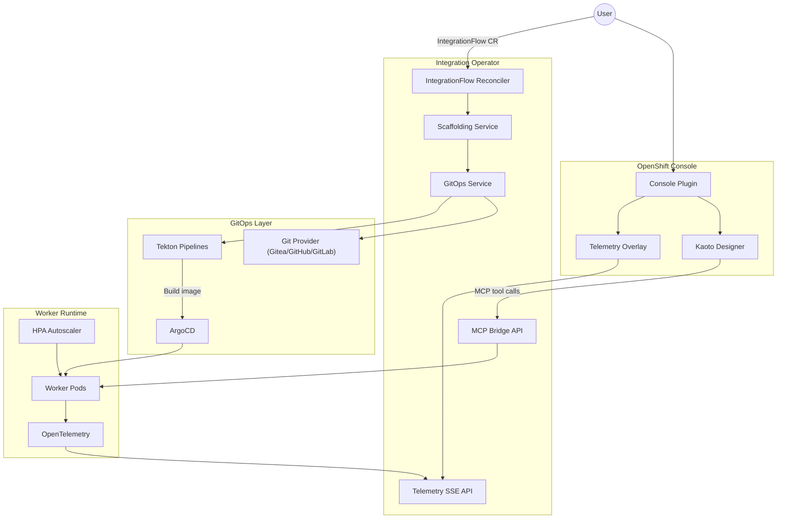

<p align="center">
  
</p>

<h1 align="center">OpenShift Integration Operator</h1>

<p align="center">
  <strong>Real-Time Integration & Orchestration Platform for OpenShift</strong>
</p>

<p align="center">
  Open-source alternative to n8n, powered by Apache Camel + CNCF SonataFlow, with visual Kaoto designer, MCP/AI integration, and native Kubernetes orchestration.
</p>

<p align="center">
  <a href="https://www.apache.org/licenses/LICENSE-2.0"></a>
  <a href="https://github.com/maximilianoPizarro/openshift-integration-operator/actions"></a>
  <a href="https://quay.io/repository/maximilianopizarro/openshift-integration-operator"></a>
</p>

<p align="center">
  <a href="https://maximilianopizarro.github.io/openshift-integration-operator/">Documentation</a> ·
  <a href="https://artifacthub.io/packages/search?repo=openshift-integration-operator">Artifact Hub</a> ·
  <a href="docs/architecture.html">Architecture</a> ·
  <a href="docs/quickstart.html">Quick Start</a> ·
  <a href="docs/operations.html">Operations</a>
</p>

---

## Features

- **Five Integration Types** — Run Camel Routes, Kamelets, Pipes, Tests, or SonataFlow workflows from a single `IntegrationFlow` CR
- **Multi-Provider Git** — Connect to Gitea, GitHub, or GitLab for scaffolded worker source with auto-detection
- **Visual Designer** — Embedded Kaoto canvas in the OpenShift Console for drag-and-drop flow design
- **GitOps Native** — Tekton builds container images; ArgoCD syncs worker deployments from Git
- **MCP/AI Ready** — Model Context Protocol bridge for discovering and invoking AI tools in flows
- **Observable** — OpenTelemetry instrumentation with real-time SSE telemetry for canvas node coloring
- **Auto-scaling Workers** — HPA v2-driven worker pods scale on CPU and memory utilization
- **Multi-cluster** — Target multiple clusters from a single IntegrationFlow spec via ArgoCD ApplicationSets
- **SonataFlow Integration** — Auto-deploys SonataFlow CRs to the OpenShift Serverless Logic operator with Management Console links
- **Lifecycle Management** — Pause/Resume/Stop, scheduled execution, declarative retry + circuit breaker
- **Platform Dashboard** — Real-time health monitoring of Operator, Kaoto, Gitea, ArgoCD, Tekton, OTel
- **Apache 2.0 License** — Free to use, modify, and distribute

## Screenshots

| Integration Flows | Visual Diagram | Kaoto Designer |
|---|---|---|
|  |  |  |

| YAML Editor | Spec & Status | Platform Status |
|---|---|---|
|  |  |  |

## Architecture Overview



See the full [Architecture Documentation](docs/architecture.html) for CRD details, reconciliation steps, and telemetry pipeline.

## Quick Start

### Prerequisites

- OpenShift 4.14+
- Helm 3
- `oc` CLI
- A Git server (Gitea, GitHub, or GitLab), ArgoCD, and Tekton Pipelines installed on the cluster

### Install with Helm

```bash
helm repo add integration-platform \
  https://maximilianopizarro.github.io/openshift-integration-operator/

helm repo update

helm install integration-operator \
  integration-platform/openshift-integration-operator \
  --namespace openshift-integration \
  --create-namespace
```

### Example: Camel Route — REST to Kafka

```bash
oc apply -f - <<'EOF'
apiVersion: platform.io/v1alpha1
kind: IntegrationFlow
metadata:
  name: rest-to-kafka
  namespace: openshift-integration
spec:
  integrationType: CAMEL_ROUTE
  gitRepository: https://gitea.example.com/user1/rest-to-kafka
  branch: main
  kaotoDesign: |
    - route:
        id: rest-to-kafka
        from:
          uri: "platform-http:/api/ingest"
          steps:
            - log:
                message: "Received: ${body}"
            - to:
                uri: "kafka:integration-events?brokers=my-cluster-kafka-bootstrap:9092"
EOF
```

### Example: Camel Route — Content-Based Routing

```bash
oc apply -f - <<'EOF'
apiVersion: platform.io/v1alpha1
kind: IntegrationFlow
metadata:
  name: order-routing-cbr
  namespace: openshift-integration
spec:
  integrationType: CAMEL_ROUTE
  gitRepository: https://gitea.example.com/user1/order-routing-cbr
  branch: main
  kaotoDesign: |
    - route:
        id: order-routing-cbr
        from:
          uri: "platform-http:/api/orders"
          steps:
            - unmarshal:
                json: {}
            - choice:
                when:
                  - simple: "${body[priority]} == 'high'"
                    steps:
                      - log:
                          message: "CRITICAL: fast-track order"
                otherwise:
                  steps:
                    - log:
                        message: "Standard order processing"
EOF
```

### Example: SonataFlow Workflow

```bash
oc apply -f - <<'EOF'
apiVersion: platform.io/v1alpha1
kind: IntegrationFlow
metadata:
  name: file-processor-workflow
  namespace: openshift-integration
spec:
  integrationType: SONATAFLOW
  gitRepository: https://gitea.example.com/user1/file-processor-workflow
  branch: main
EOF
```

The platform ships **8 pre-built examples** covering Camel Routes (REST, CBR, parallel enrichment, error handling with DLQ), Kamelets, Pipes, and SonataFlow workflows.

See the [Quick Start Guide](docs/quickstart.html) for all 8 examples, and the [Operations Guide](docs/operations.html) for validation and troubleshooting.

## Project Structure

```
openshift-integration-operator/
├── src/main/java/io/platform/
│   ├── api/v1alpha1/          # IntegrationFlow CRD types + IntegrationType enum
│   ├── operator/              # Reconciler controller
│   ├── service/               # Scaffolding & GitOps services
│   │   └── git/               # GitProvider interface + Gitea/GitHub/GitLab impls
│   ├── telemetry/             # SSE telemetry API
│   └── mcp/                   # MCP bridge API
├── console-plugin/            # OpenShift Console dynamic plugin
│   ├── src/components/        # React UI (Kaoto, telemetry overlay)
│   └── console-extensions.json
├── helm/openshift-integration-operator/
│   ├── templates/             # Operator, HPA, ConsolePlugin, Kaoto manifests
│   ├── values.yaml
│   └── Chart.yaml
├── docs/                        # GitHub Pages site
│   ├── index.html
│   ├── architecture.html
│   ├── quickstart.html
│   ├── operations.html
│   └── artifacthub-repo.yml
├── .github/workflows/
│   └── build-push-quay.yml    # CI: build, test, push to Quay.io
└── pom.xml                      # Quarkus + Operator SDK
```

## Development Setup

### Requirements

- JDK 17
- Maven 3.9+
- Node.js 18+ (for console plugin)
- Docker (for container builds)

### Run the Operator Locally

```bash
# Start in Quarkus dev mode (hot reload)
mvn quarkus:dev
```

The operator exposes REST endpoints at `http://localhost:8080`:

| Endpoint | Description |
|----------|-------------|
| `GET /api/telemetry/stream/{flowId}` | SSE stream of node telemetry |
| `GET /api/telemetry/snapshot/{flowId}` | Point-in-time node status |
| `GET /api/mcp/tools?serverUrl=...` | List MCP tools |
| `POST /api/mcp/tools/{name}/call` | Invoke an MCP tool |

### Build Console Plugin

```bash
cd console-plugin
npm install
npm run build
```

### Build Container Image

```bash
mvn package -DskipTests
docker build -f src/main/docker/Dockerfile.jvm \
  -t quay.io/maximilianopizarro/openshift-integration-operator:dev .
```

## CI/CD Overview

| Workflow | Trigger | Actions |
|----------|---------|---------|
| **Build and push to Quay.io** | Push to `main`, manual dispatch | Maven build & test, push operator image to Quay.io, package Helm chart to `docs/` |
| **Deploy to OpenShift** | After successful build, manual dispatch | `oc login`, Helm upgrade, verify rollout, create sample IntegrationFlow |

Images are published to:

```
quay.io/maximilianopizarro/openshift-integration-operator:latest
quay.io/maximilianopizarro/integration-console-plugin:latest
```

Helm charts are served from GitHub Pages:

```
https://maximilianopizarro.github.io/openshift-integration-operator/
```

## Contributing

Contributions are welcome! To get started:

1. Fork the repository
2. Create a feature branch (`git checkout -b feature/my-change`)
3. Make your changes and add tests where applicable
4. Run `mvn test` to verify
5. Submit a pull request with a clear description of the change

Please follow existing code conventions and keep changes focused.

## License

This project is licensed under the [Apache License 2.0](https://www.apache.org/licenses/LICENSE-2.0).

---

<p align="center">
  Built by <a href="https://github.com/maximilianoPizarro"><strong>maximilianoPizarro</strong></a>
  ·
  <a href="https://maximilianopizarro.github.io/openshift-integration-operator/">GitHub Pages</a>
</p>
